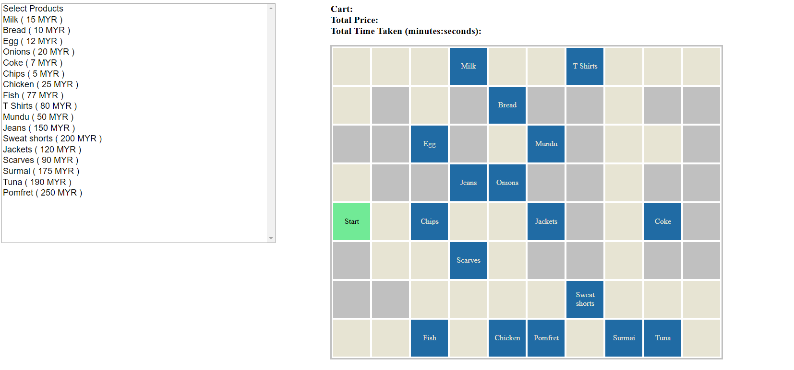
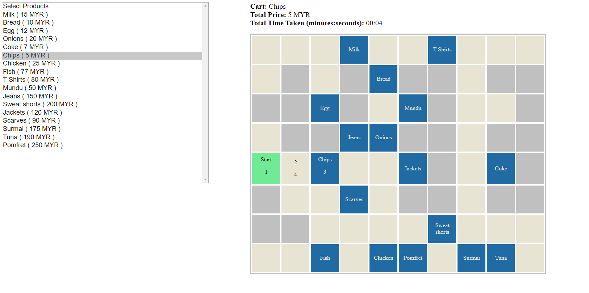
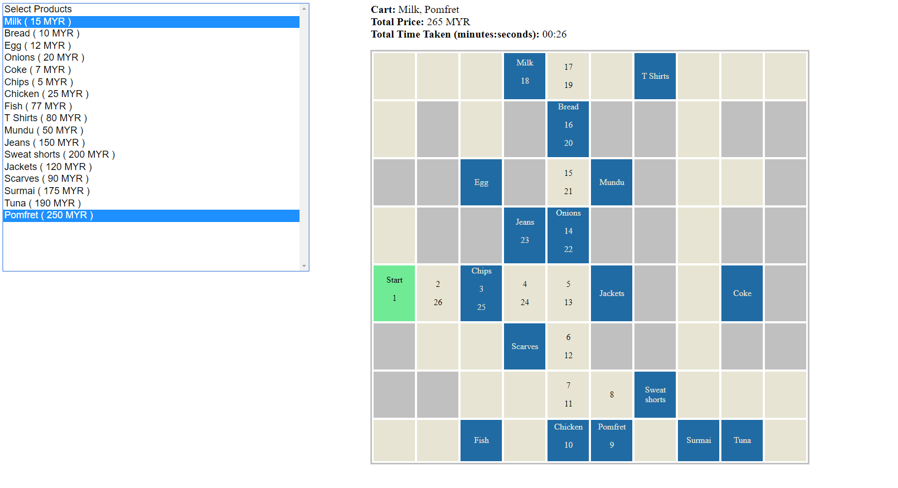

# Astro Robo Cart
An algorithm that manages delivery of products in a shopping mall using robots.

## Installation / configuration
Open the index.html file after you get the repo on your local machine.

## Database dump of data you used for testing.
The data related to grid, obstacle, product and stores are contained in this file.
config.js

## Assumptions
1. There can be only one start cell.
2. Entering a cell and leaving the cell where products are placed is considered as 1 second.
3. One grid can have only one product.
4. There will be atleast one valid path for each product.

## Test cases you used to test your solution.
1. Check if the initial screen is loaded properly.
    => All the products are loaded in the menu properly.
    => The grids is genertated properly as per the data provided in the config.js (the db file).
2. Check if different grids in the layout can be set as the starting point.
3. In case 2 grids are set as starting point, the entire application is disable with the log message and alert "You can have only one starting point".
4. Check if products are moved to different grid they are moved in the UI.
5. Check if the algorithm starts from the start point and ends at start point passing through all the selected products.

## Documentation and O(n)
Documentation and complexity added to the code as comments.

## Screenshot

